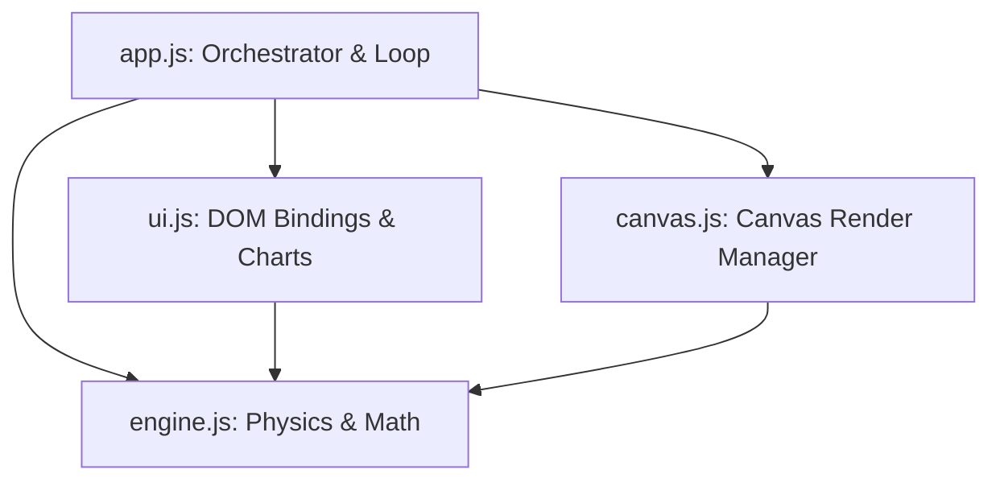

# QuantumSandbox: Core Dynamics & Mathematical Foundations

QuantumSandbox is a high-performance 2D N-body physics simulation engine built entirely in client-side HTML5, CSS3, and ES6 modular JavaScript. The system models particles interacting under simultaneous gravitational and electrostatic fields, resolving circle-to-circle elastic collisions, medium drag, and black hole accretion events.

---

## 1. Mathematical Physics Model

### 1.1 Universal Gravitation with Softened Kernel
For any pair of particles $i$ and $j$, the classical Newtonian gravitational force is defined as:
$$\vec{F}_{g,ij} = G \frac{m_i m_j}{r^2} \hat{r}_{ij}$$

Where:
- $G$ is the gravitational constant.
- $m_i, m_j$ are the masses of the interacting bodies.
- $r$ is the Euclidean distance: $r = \|\vec{x}_j - \vec{x}_i\|$.
- $\hat{r}_{ij}$ is the unit vector pointing from $i$ to $j$: $\hat{r}_{ij} = \frac{\vec{x}_j - \vec{x}_i}{r}$.

#### Singularity Avoidance via Kernel Softening
In a discrete-time 2D simulation, when particles get extremely close ($r \to 0$), the force approaches infinity. This causes numerical overflow, resulting in particles catapulting off-screen at near-infinite speeds. To prevent this, we introduce a **softening factor** ($\epsilon = 12.0$ pixels):
$$\vec{F}_{g,ij} = G \frac{m_i m_j}{(r^2 + \epsilon^2)^{1.5}} \vec{r}_{ij}$$

By scaling the force vector directly by $\vec{r}_{ij} = \vec{x}_j - \vec{x}_i$, we eliminate the division-by-zero risk:
$$(r^2 + \epsilon^2)^{1.5} = \left(\sqrt{r^2 + \epsilon^2}\right)^3$$
This ensures that as $r \to 0$, the force vector smoothly approaches zero rather than blowing up to infinity.

---

### 1.2 Coulomb Electrostatics with Softened Kernel
Electrostatic interactions follow Coulomb's Law, representing attractive forces between opposite charges and repulsive forces between like charges:
$$\vec{F}_{e,ij} = -k_e \frac{q_i q_j}{(r^2 + \epsilon^2)^{1.5}} \vec{r}_{ij}$$

Where:
- $k_e$ is the electrostatic Coulomb constant.
- $q_i, q_j$ are the electrical charges of the particles.
- The negative sign ensures that:
  - If $q_i \cdot q_j > 0$ (like charges), the force vector is parallel to $-\vec{r}_{ij}$ (repulsion).
  - If $q_i \cdot q_j < 0$ (opposite charges), the force vector is parallel to $+\vec{r}_{ij}$ (attraction).

---

### 1.3 Total Force Summation
The total force $\vec{F}_i$ acting on particle $i$ is the vector sum of all gravitational and electrostatic interactions:
$$\vec{F}_i = \sum_{j \neq i} \left( \vec{F}_{g,ij} + \vec{F}_{e,ij} \right)$$

By applying **Newton's Third Law** ($\vec{F}_{ij} = -\vec{F}_{ji}$), we optimize force calculations to run in $O(N^2 / 2)$ pairwise evaluations instead of $O(N^2)$, doubling performance.

---

## 2. Numerical Integration & Orbital Stability

### 2.1 The Failure of Semi-Implicit Euler Integration
Standard physics loops often implement Semi-Implicit Euler integration:
$$\vec{v}(t + dt) = \vec{v}(t) + \vec{a}(t) \cdot dt$$
$$\vec{x}(t + dt) = \vec{x}(t) + \vec{v}(t + dt) \cdot dt$$

While computationally cheap, Euler integration is not a **symplectic integrator** (it does not conserve phase space volume). Over time, orbital paths artificially gain energy (orbit inflation), causing planets to spiral outwards and systems to disintegrate.

### 2.2 Velocity Verlet Integration
To ensure orbital conservation, QuantumSandbox implements the **Velocity Verlet algorithm**, a second-order integration scheme that matches the physical trajectory with higher accuracy:

1. **Update Positions** (using current velocity and acceleration):
   $$\vec{x}(t + dt) = \vec{x}(t) + \vec{v}(t) \cdot dt + \frac{1}{2} \vec{a}(t) \cdot dt^2$$
2. **Compute Forces** at the new positions $\vec{x}(t + dt)$ to yield the new acceleration $\vec{a}(t + dt)$.
3. **Update Velocities** (using the average of old and new accelerations):
   $$\vec{v}(t + dt) = \vec{v}(t) + \frac{1}{2} \left[ \vec{a}(t) + \vec{a}(t + dt) \right] \cdot dt$$

This ensures that orbital energy fluctuates around a stable, bounded mean instead of accumulating numerical errors monotonically.

---

## 3. Collision Resolution & Inelastic Accretion

### 3.1 Circle-to-Circle Elastic Collisions
When two particles overlap ($r < R_i + R_j$), we apply a two-step resolution:

#### Step 1: Positional Correction (Overlap Resolution)
To prevent particles from sticking or overlapping due to time-step discretization, we push them apart along the collision normal $\vec{n} = \frac{\vec{x}_j - \vec{x}_i}{\|\vec{x}_j - \vec{x}_i\|}$. The correction distance is proportional to their inverse masses ($w_i = 1/m_i$):
$$\vec{x}_i \leftarrow \vec{x}_i - \vec{n} \cdot \text{penetration} \cdot \frac{w_i}{w_i + w_j}$$
$$\vec{x}_j \leftarrow \vec{x}_j + \vec{n} \cdot \text{penetration} \cdot \frac{w_j}{w_i + w_j}$$

#### Step 2: Velocity Impulse Resolution
We calculate the relative velocity along the normal:
$$v_n = (\vec{v}_j - \vec{v}_i) \cdot \vec{n}$$

If $v_n > 0$, the particles are already moving apart, and we skip impulse calculation. Otherwise, the impulse scalar $J$ is calculated using the restitution coefficient ($e \in [0, 1]$):
$$J = \frac{-(1 + e) v_n}{\frac{1}{m_i} + \frac{1}{m_j}}$$

The velocities are updated symmetrically:
$$\vec{v}_i \leftarrow \vec{v}_i - \frac{J}{m_i} \vec{n}$$
$$\vec{v}_j \leftarrow \vec{v}_j + \frac{J}{m_j} \vec{n}$$

---

### 3.2 Black Hole Accretion (Inelastic Merging)
When a standard particle crosses the event horizon of a black hole particle ($r < R_{bh}$), it is completely absorbed.
To maintain physical realism, we apply the **Conservation of Linear Momentum**:
$$\vec{p}_{final} = \vec{p}_{bh} + \vec{p}_{particle}$$
$$m_{bh,new} \cdot \vec{v}_{bh,new} = m_{bh} \cdot \vec{v}_{bh} + m_p \cdot \vec{v}_p$$
$$\vec{v}_{bh,new} = \frac{m_{bh}\vec{v}_{bh} + m_p\vec{v}_p}{m_{bh} + m_p}$$

The mass is combined:
$$m_{bh,new} = m_{bh} + m_p$$
And the event horizon radius expands:
$$R_{bh,new} = R_{bh,initial} + 0.15 \cdot \sqrt{m_p}$$

---

## 4. Software Architecture

- **`engine.js`**: Pure mathematical calculations. Contains `Vector2D` linear algebra, `Particle` state objects, and the `PhysicsEngine` tick loops.
- **`canvas.js`**: Handles background grids, particle glowing rendering, vector force grids, and drag indicators.
- **`ui.js`**: Manages panel input binding events, slider displays, custom rolling Canvas line charts, and simulation presets.
- **`app.js`**: Coordinates execution frames via `requestAnimationFrame` and binds click-and-drag mouse events.
